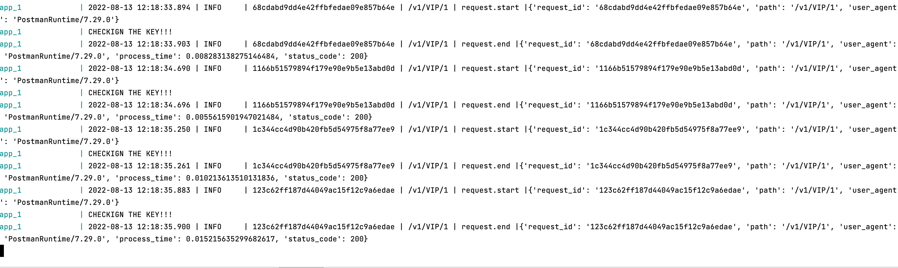
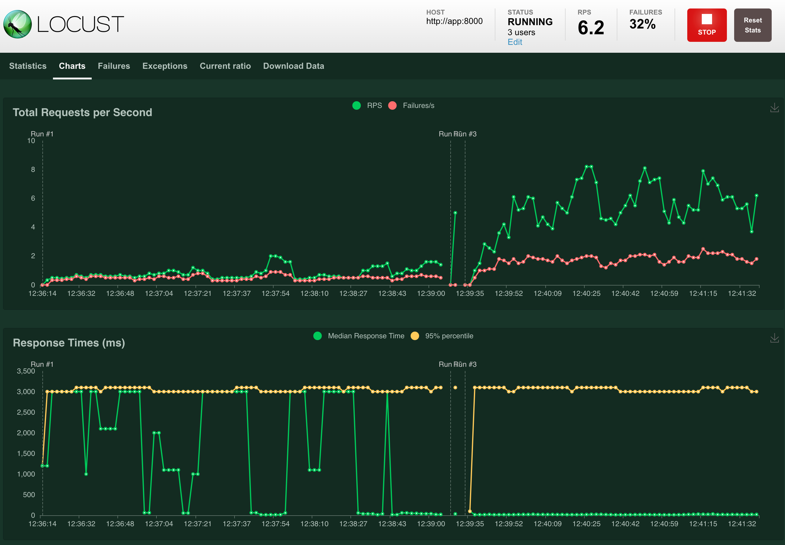

# UberServer

## How to run

The whole application can be run via `docker-compose`.

```commandline
docker-compose up -d
```

Afterwards, you should be able to access all of it's resources:

- http://localhost:8000/ - API itself
- http://localhost:8089/ - Locust - used for load testing
- http://localhost:8000/redoc - Redoc - API documentation

To run tests you can execute them in the running app container:

```commandline
docker-compose exec app pytest
```

## API

### Tech stack
 - `FastAPI` with `gunicorn` and `uvicorn` to serve the application
 - `Pydantic` - schema validation and configuration
 - `Poetry` - dependency management
 - `loguru` - logging
 - `redis` - response caching and rate limiting

### SLA
To comply with SLA, the app:
- limits the waiting time for DB server to 3 seconds (configurable in `.env`)
- caches HTTP 200 responses (`redis` or in-memory, based on the configuration)
- introduces rate limiting based on the provided auth token

For this project, all is done on the application level (alternatively could be on a proxy level).

### Authentication
All endpoints require authentication with a `Bearer` token (`Authorization` header). 
Allowed tokens specified in `.env`.

### Endpoints:
- **GET** */v1/now* - get current unix epoch in ISO 8601 format
```commandline
$ curl -H "Authorization: Bearer Vr5PVq0njFGtD" http://localhost:8000/v1/now
{
  "now": "2020-12-07T09:05:29+0000",
}
```

- **GET** */v1/VIP/{point-in-time}* - return location in time
```commandline
$ curl -H "Authorization: Bearer Vr5PVq0njFGtD" http://localhost:8000/v1/VIP/1
{
    "source": "vip-db",
    "gpsCoords": {
        "lat":29.90002,
        "long":80.95269
    }
}
```


## Configuration
Application is configurable via environment variables, see `.env` file for more details. 

## Logging

Each request is logged with relevant details. To simplify their navigation, a unique request ID is added to all logs within endpoint execution.



A possible improvement could be adding special tools for monitoring. 
For example `Grafana` (with `Prometheus`, `Loki`, `Tempo`, ..), `Sentry`, etc.


## Load testing
  For this project, Locust is used for load testing. It allows us to easily spawn traffic on our API.
  
After the whole application is running, you can access Locust on http://localhost:8089/ and press `Start swarming` to start load testing.



You can see that the response time never took more than 3 seconds, even with higher loads.
